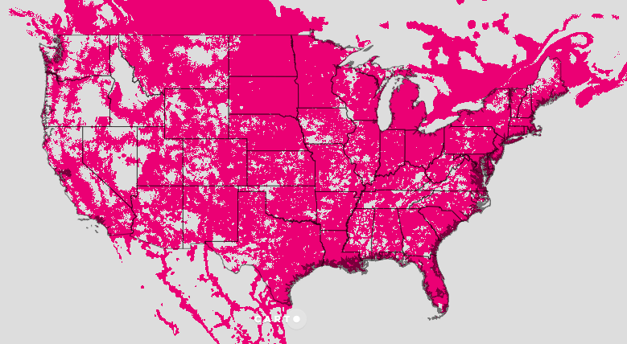

# T-Mobile Spectrum Map Tile Redirect Service

This is a flask app that redirect T-Mobiile Map services which is essentially off by 1 in the XYZ system. 

You should be able to use `http://tmobilespectrummaptile.cartodb.io/{z}/{x}/{y}.png` as a tile service for T-Mobile coverage data. 

So a normal `maps.com/0/0/0.png` for Spectrum is  `http://maps.t-mobile.com/TMo_TechLTE_Map/1/1:1/tile.png`

I found this from this code: [http://maps.t-mobile.com/pcc/app/pccService.17159.js](http://maps.t-mobile.com/pcc/app/pccService.17159.js) at `function createImageLayer`, noticed they are appending 1 to each tile request for Google Maps. 

* [Spectrum Spatial Developer Guide](http://support.pb.com/help/spectrum/9.0/pdf/en/Spectrum_9.0_SpatialDeveloperGuide.pdf)

* [T-Mobile Coverage Map Landing Page](https://www.t-mobile.com/coverage/coverage-map)

`http://maps.t-mobile.com/TMo_TechLTE_Map/6/5:11/tile.png`

Served from this redirect Flask app:

`http://tmobilespectrummaptile.cartodb.io/5/4/10.png`

[https://tmobilespectrummaptile.cartodb.io/5/4/10.png](https://tmobilespectrummaptile.cartodb.io/5/4/10.png)

## In CARTO Builder

